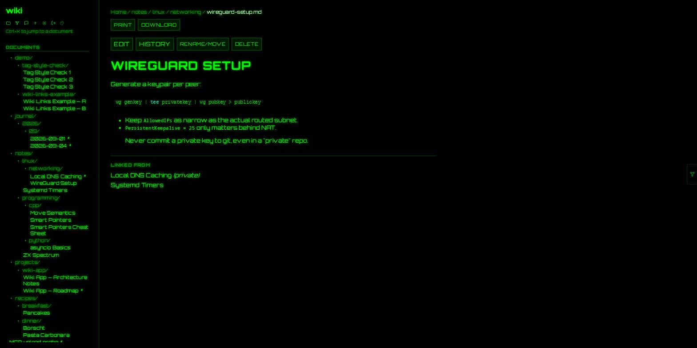
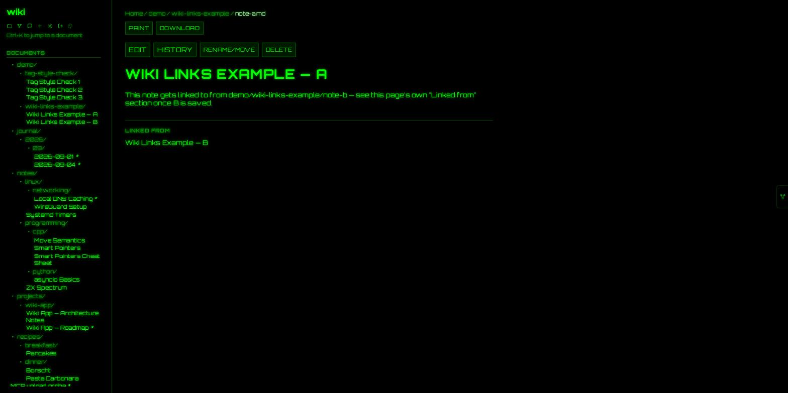
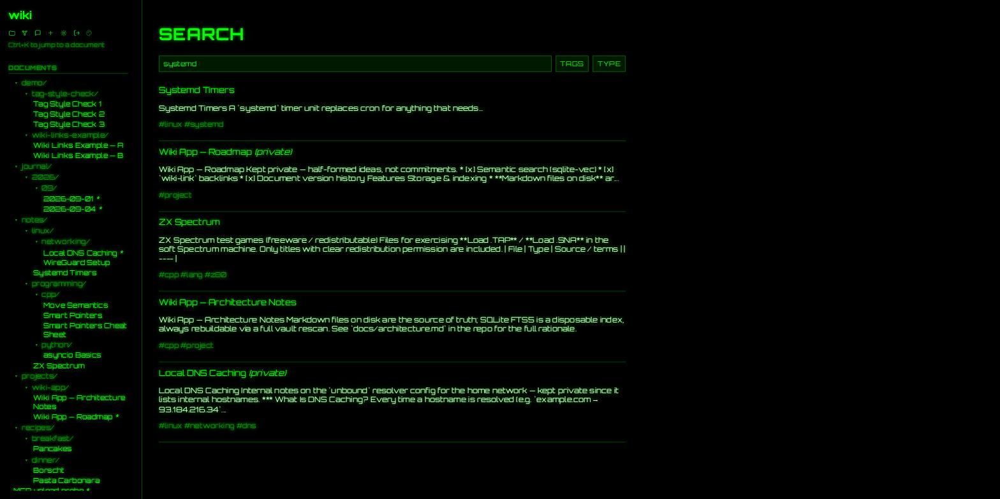
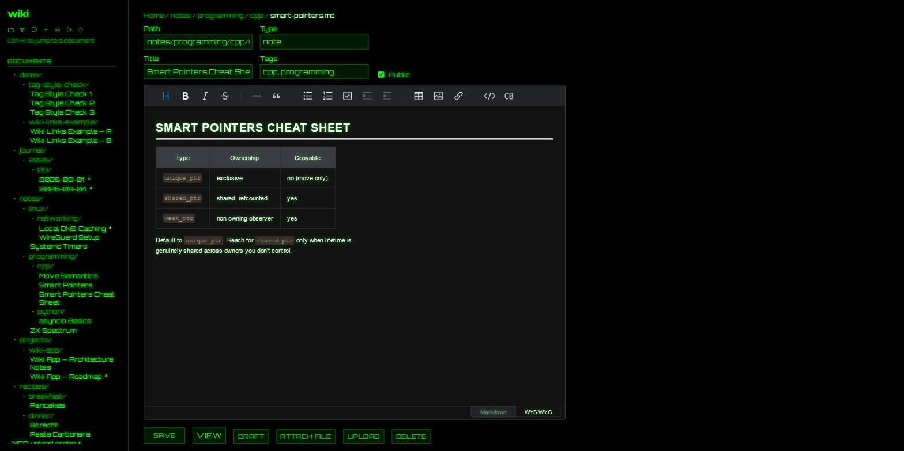
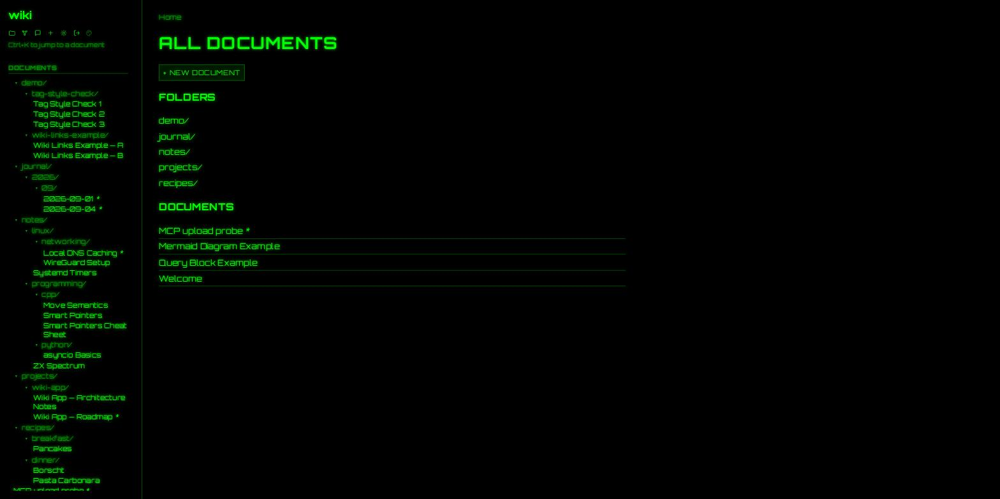
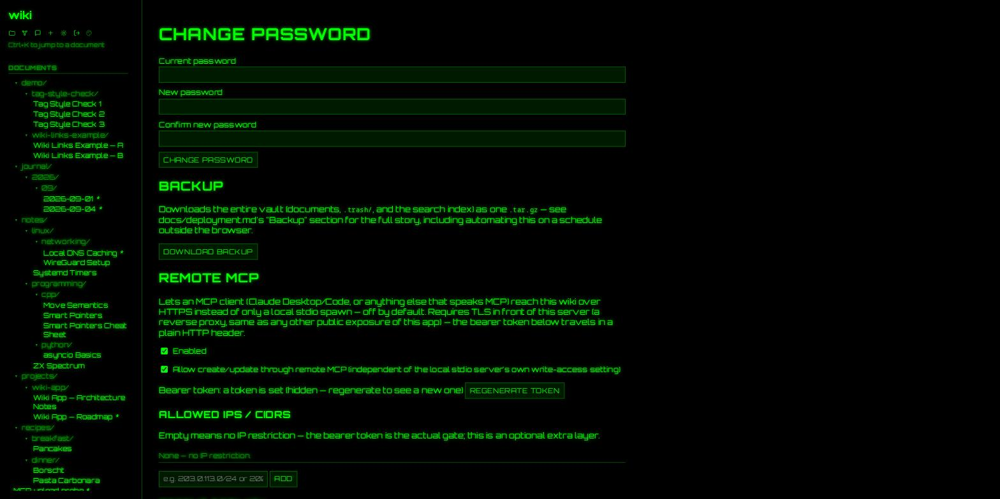
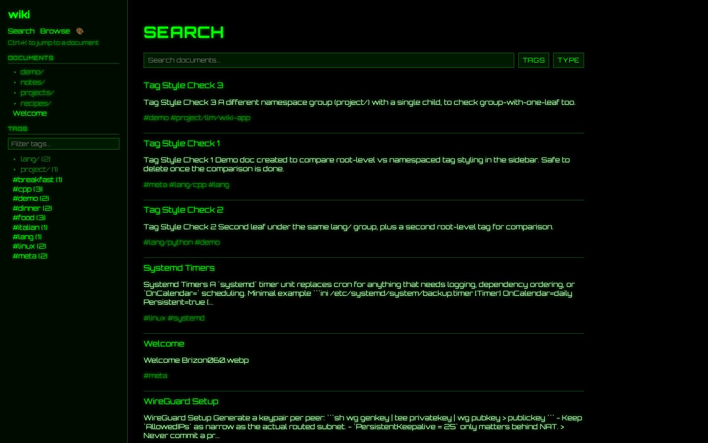
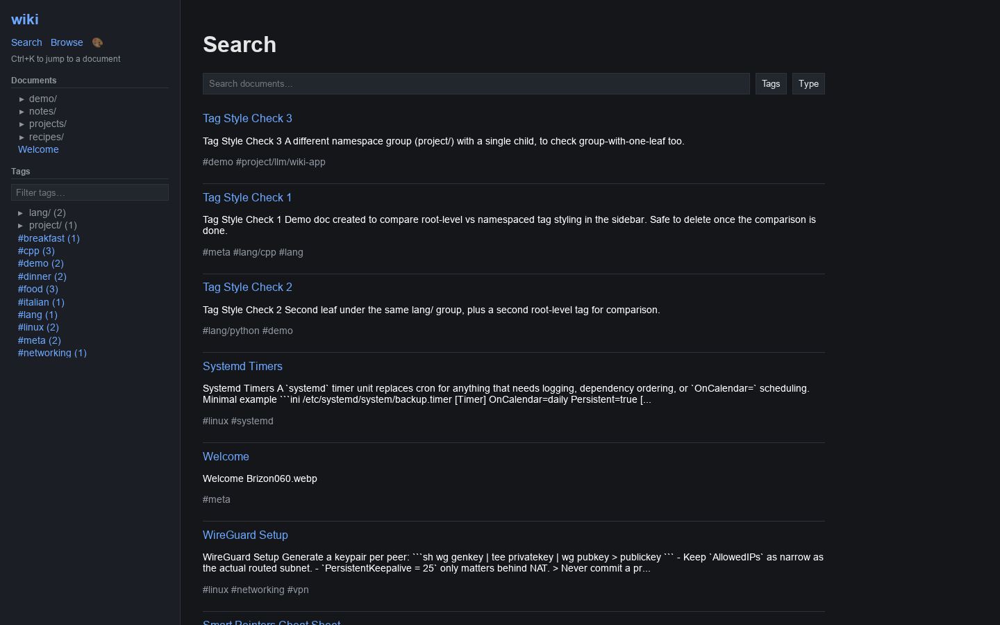
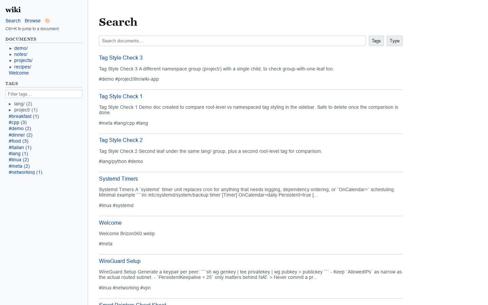

# Personal Wiki

A personal knowledge base that's just markdown files on disk — full-text search, a
clean WYSIWYG/markdown editor, public/private visibility per document, and an MCP
server so Claude (or any MCP client) can search, read, and — if you let it — write
your notes directly. One C++ binary, no database server, no runtime dependency beyond
what ships with it. Built to run comfortably on a Raspberry Pi.


---

## Screenshots

| | |
|---|---|
|  **Document view** — filterable, namespace-grouped tags (`lang/cpp`, `lang/python`…), resizable document tree, print/export |  **`[[wiki-links]]` + backlinks** — "Linked from" section, generated automatically |
|  **Full-text search** — FTS5 with prefix matching, `bm25()` ranking, tag/type filters |  **WYSIWYG editor** — Toast UI Editor, undo/redo, syntax-highlighted code blocks |
|  **Folder browser** — every document and folder, one click away |  **Admin panel** — one-click vault backup, remote MCP with a bearer token and IP allowlist |

### Themes

Pick from a small 🎨 icon in the sidebar — the choice sticks per browser via
`localStorage`, no server round-trip. Each theme is a complete, independent
stylesheet (`static/css/themes/*.css`), not one palette with variables swapped
underneath, so a fourth theme later is just a new file, not a refactor.

| Green (default) | Dark | Classic |
|---|---|---|
|  |  |  |
| glowing terminal look, digital-rain canvas background | plain neutral dark UI, no glow, no caps | white background, MediaWiki-style blue links, serif headings |

## Features

- **Markdown on disk is the only source of truth.** Every document is a plain `.md`
  file with YAML front-matter (`title`, `tags`, `visibility`, `type`). SQLite is a
  disposable search index, never a second copy of the truth — delete it, it rebuilds
  from the vault on the next start.
- **Full-text search that's actually good.** FTS5 with prefix matching (`time` finds
  "Systemd Timers"), `bm25()`-ranked column weighting, and multiselect tag/type
  filters.
- **`[[wiki-links]]` and automatic backlinks**, Obsidian-style — link two notes,
  see the connection from both ends without touching either file's `tags`.
- **Namespaced tags, filterable.** A tag containing `/` (`lang/cpp`, `project/wiki`)
  groups into a collapsible tree in the sidebar instead of one long flat list; a filter
  box above it narrows by substring. Purely a client-side convention — the server
  treats `/` as just another character.
- **A real editor, not a textarea.** Toast UI Editor (WYSIWYG + raw markdown), undo/
  redo, drag-and-drop image upload routed through the same attachment pipeline as
  everything else.
- **`` embeds** that render as a real `<iframe>` — `youtu.be`,
  `/watch?v=`, and `/shorts/` links all recognized, with a thumbnail preview right in
  the editor.
- **Document history.** Every edit is snapshotted; diff any two versions, restore any
  of them (which itself snapshots first — restoring is undoable too).
- **Fail-safe-private visibility.** Missing or malformed front-matter defaults to
  `private`, always. A private document returns a plain `404` to an anonymous
  request — not `403` — so its existence isn't revealed either.
- **One-click vault backup** from the admin panel, plus an opt-in `systemd` timer for
  unattended, rotated, offsite backups.
- **MCP server, both ways.** `wiki-mcp` (stdio) for a local Claude Desktop/Code
  spawn — zero HTTP overhead, starts instantly. A separate, admin-toggleable **remote
  MCP transport** (bearer token, optional IP allowlist, its own rate limiter) lets an
  MCP client reach the same tools over HTTPS from anywhere. Read tools always on;
  write tools (`create_document`/`update_document`) are an explicit opt-in, every call
  audit-logged regardless of outcome.
- **Three switchable visual themes** — green-on-black terminal, a plain neutral dark
  UI, and a classic MediaWiki-style light theme — picked from a small icon in the
  sidebar, remembered per browser. Each is a fully independent CSS file, not a shared
  palette with variables swapped underneath.
- **Built for a Raspberry Pi.** One static, cross-compiled binary — verified running
  natively on real armv7 hardware, not just in theory.

## Quick start

```sh
git clone https://github.com/ashevchuk/personal-wiki.git wiki && cd wiki

# vcpkg is bootstrapped locally, not vendored — one-time setup. A FULL
# clone, not --depth 1 — a shallow clone can end up missing vcpkg.json's
# pinned baseline commit once upstream has moved far enough past it (see
# docs/architecture.md's "Build" section for exactly why, confirmed live).
git clone https://github.com/microsoft/vcpkg.git vcpkg
./vcpkg/bootstrap-vcpkg.sh -disableMetrics

cmake -S . -B build -G Ninja \
  -DCMAKE_TOOLCHAIN_FILE=vcpkg/scripts/buildsystems/vcpkg.cmake \
  -DCMAKE_BUILD_TYPE=RelWithDebInfo
cmake --build build -j"$(nproc)"

ctest --test-dir build --output-on-failure   # unit tests + a real HTTP security suite

cp config.example.toml config.toml
./build/wiki-server --create-admin   # one-time, interactive, password not echoed
./build/wiki-server                  # listens on 127.0.0.1:8080 — GET /healthz
```

Deploying somewhere real (systemd unit, reverse proxy for TLS, native vs. cross-
compiled build for a weak/old SBC, backup timer): [`docs/deployment.md`](docs/deployment.md)
and the self-contained [`docs/sbc-deployment.md`](docs/sbc-deployment.md) runbook.

**Or, on a normal x86_64/arm64 machine (not a weak/old ARM SBC — see
[`docs/docker.md`](docs/docker.md) for why):**

```sh
mkdir -p vault_data
docker compose up -d
docker compose exec wiki wiki-server --create-admin
```

## Using it from Claude (MCP)

`wiki-mcp` is a second, separate binary — stdio JSON-RPC, spawned by the MCP client
itself, no server round-trip. Add it to `claude_desktop_config.json`:

```json
{
  "mcpServers": {
    "personal-wiki": {
      "command": "/path/to/wiki/build/wiki-mcp",
      "args": [],
      "cwd": "/path/to/wiki"
    }
  }
}
```

Four read tools are always available (`search_documents`, `get_document`, `list_tags`,
`list_documents`); `create_document`/`update_document` exist behind `[mcp].write_access`
in `config.toml` (off by default), and every write — success or failure — lands in an
audit log. Want Claude to reach the same tools over the network instead of a local
spawn? Turn on **Remote MCP** in the admin panel — bearer token, optional CIDR
allowlist, its own rate limiter, independent write-access toggle. Full protocol
details, tool schemas, and the remote-transport security model:
[`docs/mcp.md`](docs/mcp.md).

## A few things worth knowing about the security model

- **Path traversal** is centralized in one place (`PathGuard`) that every vault read/
  write goes through — canonicalized and checked against the vault root before
  anything touches disk. Tested against `../../etc/passwd`, `%2e%2e`, symlink escapes.
- **Sessions and the remote-MCP bearer token are hash-only in the database.** SHA-256,
  never the raw value — a stolen copy of the SQLite file hands over nothing usable.
  A raw token is shown exactly once, at generation time.
- **CSRF tokens travel through a delivery-only cookie**; the server-side session value
  is the actual source of truth, never the cookie by itself.
- **Anything that mixes untrusted document content with generated markup** — FTS5
  search snippets, the `![youtube]` embed substitution — uses a control-byte marker
  swapped for real HTML only *after* the surrounding text is escaped, never a literal
  tag baked into a query or an intermediate render step. The two orders of operation
  are not interchangeable; get it backwards and either the markup breaks or the
  document body becomes an XSS vector.
- **A committed, `ctest`-run security suite** (`tests/integration/security_e2e.py`)
  boots a real server against a temp vault and drives it over actual HTTP: every
  mutating route rejects an unauthenticated caller, session fixation is rejected,
  visibility gating is checked simultaneously across every read path, and a live
  filesystem watcher's indexing is verified end to end — not just asserted in a unit
  test in isolation.

## Architecture, in short

Two binaries share one static library (`libwikicore`) that has zero Drogon/OpenSSL
dependency — `vault/`, `index/`, `config/`, `util/`:

- **`wiki-server`** — the HTTP service (Drogon). A pure JSON API; every page is a
  static shell + client-side JS that renders from `fetch()` responses, nothing
  server-templated.
- **`wiki-mcp`** — the stdio MCP entrypoint. Doesn't rescan the vault on every spawn
  (an MCP client can spawn it often); trusts the index `wiki-server` already built.

The vault directory is the only thing that has to survive a disaster — the SQLite
index is a disposable cache, rebuilt with `wiki-server --reindex` or on the next
startup. Full rationale and the milestone-by-milestone build log (including a couple
of real bugs caught by an actual E2E test, not just theory) live in
[`docs/architecture.md`](docs/architecture.md).

## Tech stack

| | |
|---|---|
| HTTP | [Drogon](https://github.com/drogonframework/drogon) (C++17/20 async framework) |
| Search index | SQLite + FTS5 |
| Markdown → HTML | [md4c](https://github.com/mity/md4c) (raw HTML passthrough deliberately disabled — that flag *is* the sanitization) |
| Front-matter | [yaml-cpp](https://github.com/jbeder/yaml-cpp) |
| Password hashing | argon2id ([libargon2](https://github.com/P-H-C/phc-winner-argon2)) |
| Config | [toml++](https://github.com/marzer/tomlplusplus) |
| WYSIWYG editor | [Toast UI Editor](https://github.com/nhn/tui.editor) (vendored, committed) |
| MCP protocol | [hkr04/cpp-mcp](https://github.com/hkr04/cpp-mcp) (vendored via `FetchContent`) |
| Tests | [Catch2](https://github.com/catchorg/Catch2) (unit) + a stdlib-only Python HTTP suite (integration) |
| Package manager | [vcpkg](https://github.com/microsoft/vcpkg), manifest mode |
| Cross-compilation | [zig](https://ziglang.org/) → static `arm-linux-musleabihf`, for old/weak ARM targets |
| Containers | Docker, multi-stage build — for a normal x86_64/arm64 machine, not the weak-SBC path above |

## Status

All originally-planned milestones are done — bootstrap, auth, CRUD/WYSIWYG,
search/nav, MCP (stdio + remote), hardening, deployment — plus a second pass adding
document versioning, `[[wiki-links]]` backlinks, Cmd-K quick-open, vault backup,
YouTube embeds, a Docker build, and a filterable/namespaced tag tree in the sidebar.
Deployed and verified running on real ARM hardware via cross-compilation; see
[`docs/deployment.md`](docs/deployment.md) for the exact, current verification status.
Semantic search (`sqlite-vec` + embeddings) is the one deliberately-deferred item — no
embedding-source decision made yet.

## License

[MIT](LICENSE).
