# Personal Wiki

A personal knowledge base where plain markdown files on disk are the only
source of truth. On top of that you get full-text search, a WYSIWYG/markdown
editor, public/private visibility per document, and an MCP server so Claude
(or any MCP client) can search, read, and — if you allow it — write your
notes directly.

It ships as one C++ binary with no database server and no runtime dependency
beyond what's already bundled in. It's built to run comfortably on a
Raspberry Pi or similar ARM/x86_64 single-board computer.


---

## Screenshots

| | |
|---|---|
| 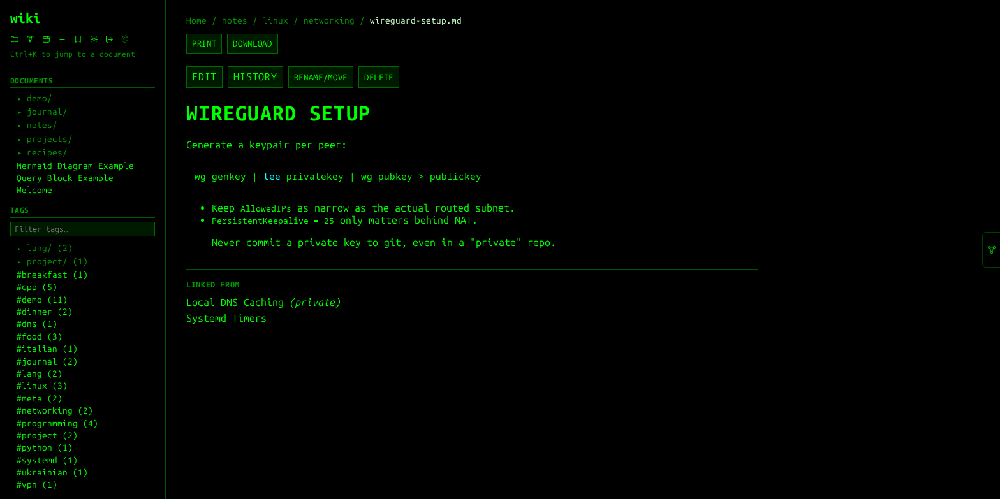 **Document view** — filterable, namespace-grouped tags (`lang/cpp`, `lang/python`…), resizable document tree, print/export | 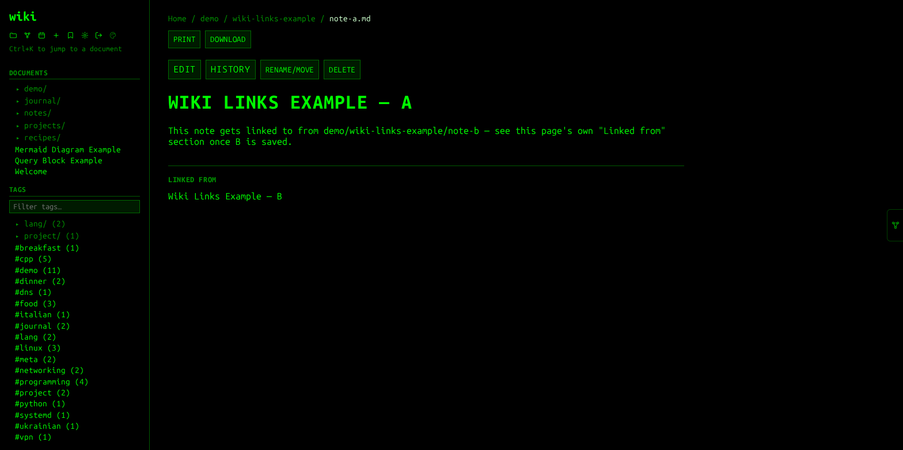 **`[[wiki-links]]` + backlinks** — a "Linked from" section is generated automatically |
| 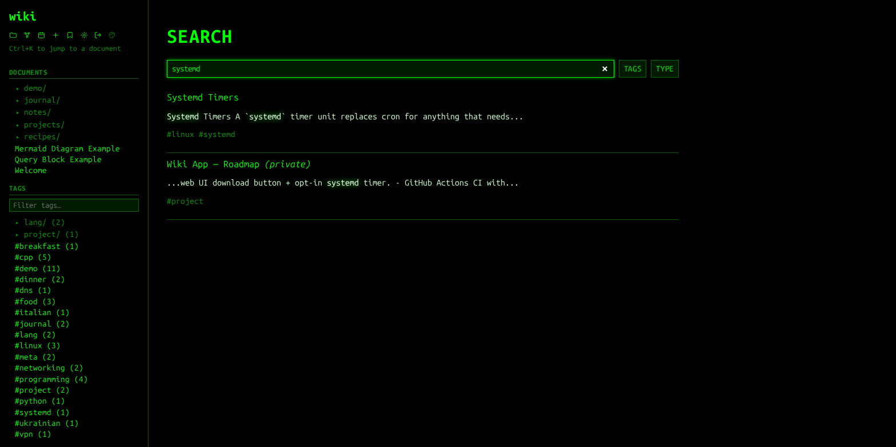 **Full-text search** — FTS5 with prefix matching, `bm25()` ranking, tag/type filters | 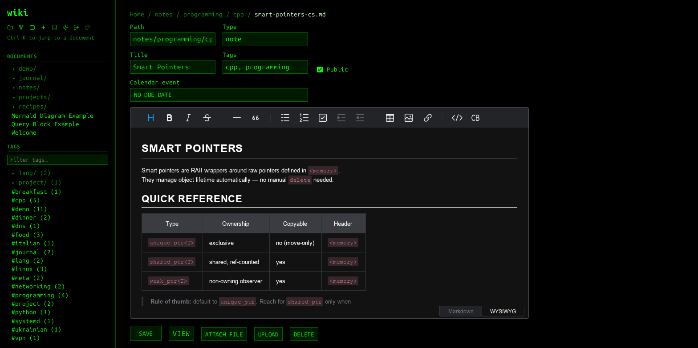 **WYSIWYG editor** — Toast UI Editor, undo/redo, syntax-highlighted code blocks |
| 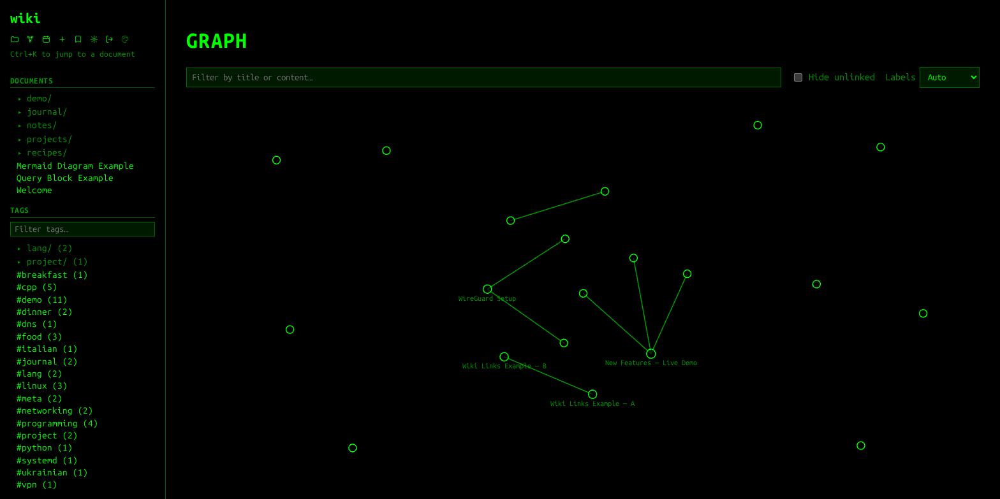 **Graph view** — every `[[wiki-link]]` as an edge, force-directed layout, filter by title/content | 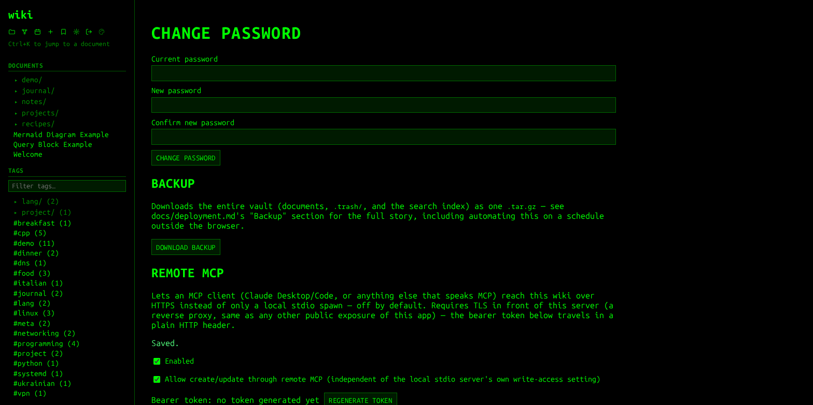 **Admin panel** — one-click vault backup, remote MCP with a bearer token and IP allowlist |
| 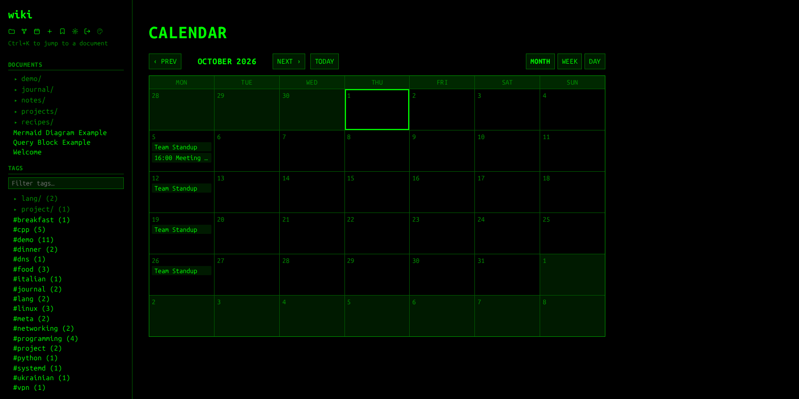 **Calendar** — admin-only month/week/day view of every document's due date, recurring events included | 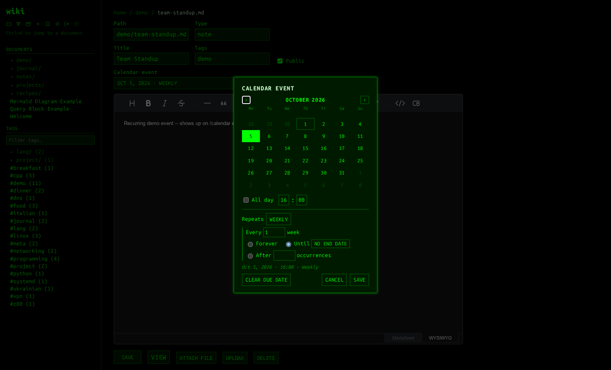 **Custom date/time/recurrence picker** — no native `<input type="date">`, every control themeable |

### Themes

Pick a theme from the small 🎨 icon in the sidebar. The choice is remembered
per browser (`localStorage`), with no server round-trip. Each theme is a
complete, independent stylesheet, not one shared palette with variables
swapped underneath — so adding a fourth theme later means adding one file,
not refactoring three.

| Green (default) | Dark | Classic |
|---|---|---|
| 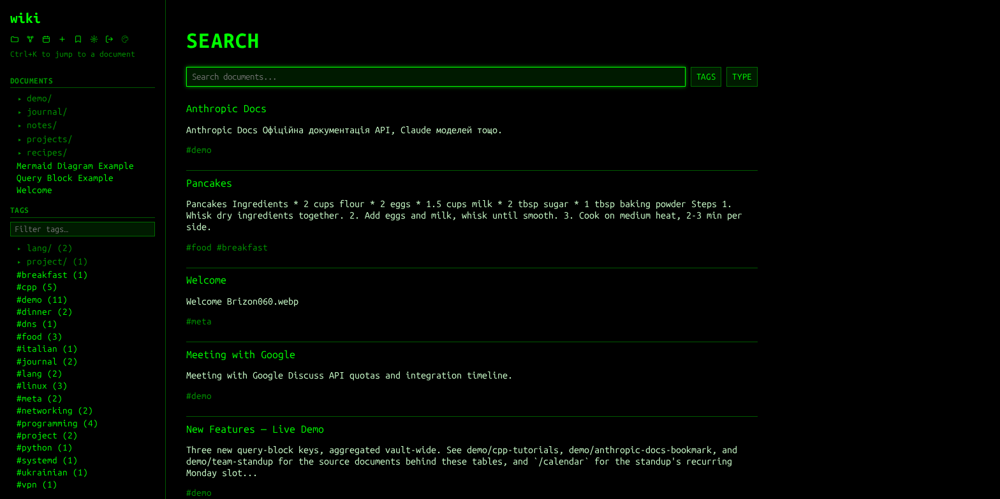 | 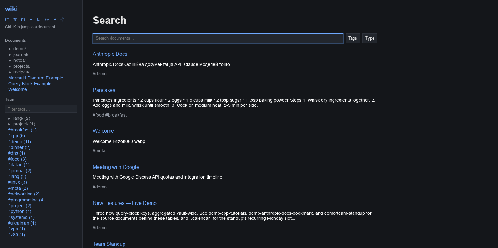 | 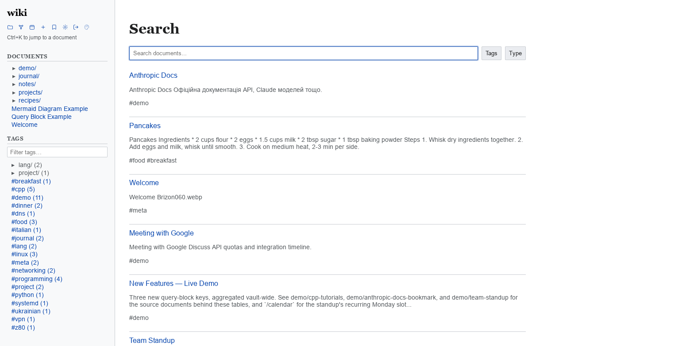 |
| glowing terminal look | plain neutral dark UI, no glow, no caps | white background, MediaWiki-style blue links, serif headings |

## Features

**Storage and search**

- Every document is a plain `.md` file with YAML front matter (`title`,
  `tags`, `visibility`, `type`). SQLite is only a search index on top of
  that — delete it and it rebuilds from the vault on the next start.
- Full-text search is genuinely good: FTS5 with prefix matching (typing
  `time` finds "Systemd Timers"), `bm25()`-ranked column weighting, and
  multiselect tag/type filters.
- Optional semantic search layers on top of full-text search, rather than
  replacing it. A query like `beet soup` can find
  `recipes/dinner/borscht.md` even with zero words in common, by blending
  FTS5's `bm25()` ranking with cosine similarity over embeddings
  (Reciprocal Rank Fusion). It's off by default and build-time-optional, so
  an SBC build stays light unless you opt in; when enabled, embeddings can
  run locally (`llama.cpp`, nothing ever leaves the machine) or against any
  OpenAI-compatible API. See [`docs/embeddings.md`](docs/embeddings.md).

**Writing and linking**

- `[[wiki-links]]` with automatic backlinks, Obsidian-style — link two notes
  and see the connection from both ends, without touching either file's
  `tags`.
- Namespaced, filterable tags: a tag containing `/` (`lang/cpp`,
  `project/wiki`) groups into a collapsible tree in the sidebar instead of
  one long flat list. This is purely a client-side convenience — the server
  treats `/` as just another character.
- A real editor, not a textarea: Toast UI Editor (WYSIWYG + raw markdown),
  undo/redo, and drag-and-drop image upload. An optional **Draft** button
  (hidden until `[llm]` is configured) fills the editor from an
  OpenAI-compatible chat API — nothing is written until you hit Save. With
  `[llm]` on, a **Chat** icon also opens a floating, read-only vault Q&A
  panel. See [`docs/llm.md`](docs/llm.md).
- `` links render as a real `<iframe>`, with a thumbnail
  preview right in the editor.
- ` ```mermaid ` code blocks render as real diagrams (flowcharts, sequence
  diagrams, anything [mermaid](https://mermaid.js.org/) supports), rendered
  client-side and loaded only on documents that actually use one.
- Syntax-highlighted code blocks on every document view (Prism.js, loaded
  lazily, themed to match the active site theme).

**Live, queryable pages**

- ` ```query ` blocks turn a fenced code block into a live, auto-updating
  table of documents right inside a page — filter by tag, type, or folder,
  find orphaned documents, sort and limit. It re-runs on every view, so an
  index or project list never goes stale. `search: <text>` embeds a real
  search box using the same engine as the site's search page. There's no
  raw SQL involved: a small whitelisted DSL, every value a bound parameter,
  and an unknown key or bad value is a clear error rather than a silent
  empty result.
- Heading-level "zoom" *(experimental)*: click "Zoom" next to any h2–h6 to
  hide everything outside that section. A shareable `#zoom=<slug>` link
  lands already focused.
- Graph view: every document is a node, every `[[wiki-link]]` is an edge.
  There's a full `/graph` page for the whole vault (filter by title or
  content, hide unlinked documents, adjust label density), plus a "local
  graph" widget on each document showing just its own connected notes.
- Calendar, admin-only: any document can carry a `due` date and a
  recurrence rule — there's no separate "event" document type. Because a
  schedule can reveal more than a single document's own visibility
  setting, the calendar is gated to the admin regardless of what any
  individual document is marked as.

**Safety and operations**

- Document history: every edit is snapshotted, any two versions can be
  diffed, and restoring an old version is itself undoable.
- Fail-safe-private visibility: missing or malformed front matter defaults
  to `private`. A private document returns a plain `404` to an
  unauthenticated request — never `403` — so its existence isn't revealed
  either.
- One-click vault backup from the admin panel, plus an opt-in `systemd`
  timer for unattended, rotated, offsite backups.
- MCP server, both ways: `wiki-mcp` (stdio) for a local Claude Desktop/Code
  spawn with zero HTTP overhead, plus a separate, admin-toggleable remote
  MCP transport (bearer token, optional IP allowlist, its own rate limiter)
  for reaching the same tools over HTTPS. Read tools are always on; write
  tools are an explicit opt-in, and every write attempt is audit-logged
  regardless of outcome.
- Built for ARM SBCs: one static, cross-compiled binary, verified running
  natively on real armv7 (Raspberry Pi–class) hardware, not just in theory.

## Quick start

```sh
git clone https://github.com/ashevchuk/personal-wiki.git wiki && cd wiki

# vcpkg is bootstrapped locally, not vendored — one-time setup.
# Use a FULL clone here, not --depth 1: vcpkg.json pins a specific baseline
# commit, and a shallow clone can end up missing it once upstream has
# moved on.
git clone https://github.com/microsoft/vcpkg.git vcpkg
./vcpkg/bootstrap-vcpkg.sh -disableMetrics

# vcpkg-configuration.json (committed) already points vcpkg at a locally
# patched md4c port that backports a fix for OSV-2022-126 (a table-parsing
# heap-buffer-overflow). No extra flags needed — vcpkg picks it up on its
# own; see overlay-ports/md4c/portfile.cmake for details.
cmake -S . -B build -G Ninja \
  -DCMAKE_TOOLCHAIN_FILE=vcpkg/scripts/buildsystems/vcpkg.cmake \
  -DCMAKE_BUILD_TYPE=RelWithDebInfo
cmake --build build -j"$(nproc)"

ctest --test-dir build --output-on-failure   # unit tests + a real HTTP security suite

cp config.example.toml config.toml
./build/wiki-server --create-admin   # one-time, interactive, password not echoed
./build/wiki-server                  # listens on 127.0.0.1:8080 — GET /healthz
```

The username you're prompted for isn't fixed to `admin` — it's whatever you
type. There's still only ever one admin account; running `--create-admin`
again overwrites the username and password together, and that's also how
you change either one later (there's no `config.toml` setting for it, since
that would just be a second source of truth competing with the one already
in SQLite).

Deploying somewhere real — a systemd unit, a reverse proxy for TLS, choosing
between a native and a cross-compiled build on a weak/old SBC, a backup
timer — is covered end-to-end in
[`docs/sbc-deployment.md`](docs/sbc-deployment.md), or automate the whole
thing with `tools/wiki-ops.sh` (see [`docs/wiki-ops.md`](docs/wiki-ops.md)).

**On a normal x86_64/arm64 machine instead of a weak/old ARM SBC** (see
[`docs/docker.md`](docs/docker.md) for why Docker isn't the recommended path
on the SBC itself):

```sh
mkdir -p vault_data
docker compose up -d
docker compose exec wiki wiki-server --create-admin
```

## Using it from Claude (MCP)

`wiki-mcp` is a second, separate binary that speaks stdio JSON-RPC — the MCP
client spawns it directly, with no server round-trip involved. Add it to
`claude_desktop_config.json`:

```json
{
  "mcpServers": {
    "personal-wiki": {
      "command": "/path/to/wiki/build/wiki-mcp",
      "args": [],
      "cwd": "/path/to/wiki"
    }
  }
}
```

Six read tools are always available: `search_documents`, `get_document`,
`list_tags`, `list_documents`, `run_query`, `get_calendar_events`.
`create_document`/`update_document` exist too, but only once
`[mcp].write_access` is turned on in `config.toml` (off by default); every
write attempt, successful or not, lands in an audit log.

Want Claude to reach the same tools over the network instead of through a
local spawn? Turn on **Remote MCP** in the admin panel — it has its own
bearer token, an optional CIDR allowlist, its own rate limiter, and an
independent write-access toggle. Full protocol details, tool schemas, and a
client config example: [`docs/mcp.md`](docs/mcp.md#connecting-a-client).

## Writing ` ```query ` blocks

A fenced code block with `query` as the language becomes a live,
auto-updating table of documents right inside a page — filter by tag, type,
or folder, find orphaned documents, sort and limit. It re-runs on every
view:

````
```query
folder: recipes/dinner/
sort: title
```
````

For the full syntax, every key, and worked examples (a recipe index, a
"what changed recently" digest, a list of documents nothing links to yet)
see [`docs/query-blocks.md`](docs/query-blocks.md).

For more on how the app actually behaves day to day — soft deletes,
how fast it notices external file changes, attachment size limits, what
MCP can and can't touch — see [`docs/behavior.md`](docs/behavior.md).

## A few things worth knowing about the security model

- **Path traversal** is handled in exactly one place (`PathGuard`), which
  every vault read or write goes through: a path is canonicalized and
  checked against the vault root before anything touches disk. It's tested
  against payloads like `../../etc/passwd`, `%2e%2e`, and symlink escapes.
- **Sessions and the remote-MCP bearer token are stored hashed, never raw.**
  A stolen copy of the SQLite database hands over nothing directly usable.
  A raw token is shown exactly once, at the moment it's generated.
- **CSRF tokens are delivered through a cookie, but that cookie is never
  the source of truth.** The server checks its own session-side value; the
  cookie is only how that value reaches the browser.
- **Anywhere untrusted document content gets mixed into generated markup**
  — search snippets, `![youtube]` embeds — uses a control-byte marker that
  gets swapped for real HTML only *after* the surrounding text has been
  escaped. Doing this in the other order either breaks the markup or turns
  the document body into an XSS vector; the two orders aren't
  interchangeable.
- **A real, automated security test suite** (`tests/integration/security_e2e.py`)
  boots an actual server against a temp vault and drives it over real HTTP:
  every mutating route is checked for rejecting unauthenticated callers,
  session fixation is checked, visibility gating is checked across every
  read path at once, and a live filesystem watcher's indexing is verified
  end to end — not just asserted in an isolated unit test.

## Architecture, in short

Two binaries share one static library, `libwikicore`, which has zero
dependency on Drogon or OpenSSL:

- **`wiki-server`** is the HTTP service (Drogon). It's a pure JSON API —
  every page is a static shell plus client-side JS that renders from
  `fetch()` responses; nothing is server-templated.
- **`wiki-mcp`** is the stdio MCP entrypoint. It doesn't rescan the vault on
  every spawn, since an MCP client may spawn it often — it trusts whatever
  index `wiki-server` already built.

The vault directory — your actual markdown files — is the only thing that
has to survive a disaster. The SQLite index is a disposable cache, rebuilt
either on the next `wiki-server` startup or with `wiki-server --reindex`.

## Tech stack

| | |
|---|---|
| HTTP | [Drogon](https://github.com/drogonframework/drogon) (C++17/20 async framework) |
| Search index | SQLite + FTS5 |
| Markdown → HTML | [md4c](https://github.com/mity/md4c) (raw HTML passthrough is deliberately disabled — that flag *is* the sanitization) |
| Front matter | [yaml-cpp](https://github.com/jbeder/yaml-cpp) |
| Password hashing | argon2id ([libargon2](https://github.com/P-H-C/phc-winner-argon2)) |
| Config | [toml++](https://github.com/marzer/tomlplusplus) |
| WYSIWYG editor | [Toast UI Editor](https://github.com/nhn/tui.editor) (vendored, committed) |
| MCP protocol | hand-rolled JSON-RPC 2.0 (`src/mcp/McpServer.cpp`, `src/controllers/RemoteMcpRoutes.cpp`) |
| Vector storage | [sqlite-vec](https://github.com/asg017/sqlite-vec) (vendored via `FetchContent`) — build-time-optional |
| Local embeddings | [llama.cpp](https://github.com/ggml-org/llama.cpp) (vendored via `FetchContent`) — build-time-optional |
| Diagrams | [mermaid.js](https://mermaid.js.org/) (vendored, ~5.3 MiB) — loaded client-side, lazily, only on documents that use it |
| Syntax highlighting | [Prism.js](https://prismjs.com/) (vendored, custom bundle) — view page only, lazily loaded |
| Tests | [Catch2](https://github.com/catchorg/Catch2) (unit) + a stdlib-only Python HTTP suite (integration) |
| Package manager | [vcpkg](https://github.com/microsoft/vcpkg), manifest mode |
| Cross-compilation | [zig](https://ziglang.org/) → static `arm-linux-musleabihf`, for old/weak ARM targets |
| Containers | Docker, multi-stage build — for a normal x86_64/arm64 machine, not the weak-SBC path above |

## Status

Feature-complete: auth, CRUD/WYSIWYG editing, search/navigation, MCP (stdio
and remote), hardening, deployment, document versioning, `[[wiki-links]]`
backlinks, vault backup, and semantic search are all implemented.
Cross-compiled builds run natively on ARM — see
[`docs/sbc-deployment.md`](docs/sbc-deployment.md), and
[`docs/wiki-ops.md`](docs/wiki-ops.md) for the build-and-deploy automation
script. Semantic search configuration is in
[`docs/embeddings.md`](docs/embeddings.md); the Draft agent and sidebar
Chat panel are documented in [`docs/llm.md`](docs/llm.md).

## License

[MIT](LICENSE).
